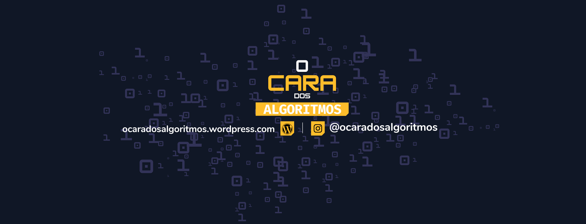

<!-- PROJECT SHIELDS -->
<!--
*** I'm using markdown "reference style" links for readability.
*** Reference links are enclosed in brackets [ ] instead of parentheses ( ).
*** See the bottom of this document for the declaration of the reference variables
*** for contributors-url, forks-url, etc. This is an optional, concise syntax you may use.
*** https://www.markdownguide.org/basic-syntax/#reference-style-links
-->
[![Contributors][contributors-shield]][contributors-url]
[![Forks][forks-shield]][forks-url]
[![Stargazers][stars-shield]][stars-url]
[![Issues][issues-shield]][issues-url]
[![MIT License][license-shield]][license-url]
[![LinkedIn][linkedin-shield]][linkedin-url]

<!-- PROJECT LOGO -->
<br />
<p align="center">
  <a href="https://github.com/ocaradosalgorimtos/projetos_python">
    
  </a>

  <h3 align="center">Jogo Advinhe o Número (Number guessing Game) - Python</h3>

  <p align="center">
    Tente descobrir o número secreto!
    <br />
    <a href="https://github.com/ocaradosalgoritmos/projetos_python/wiki"><strong>Consulte a documentação »</strong></a>
    <br />
    <br />
    <a href="https://github.com/ocaradosalgoritmos/projetos_python/tree/main/guess_the_number">Demonstração</a>
    ·
    <a href="https://github.com/ocaradosalgoritmos/projetos_python/issues">Reportar um Bug</a>
    ·
    <a href="https://github.com/ocaradosalgoritmos/projetos_python/issues">Sugerir uma melhoria</a>
  </p>
</p>

<!-- TABLE OF CONTENTS -->
## Índice

* [Sobre o projeto](#sobre-o-projeto)
  * [Tecnologias utilizadas](#tecnologias-utilizadas)
* [Instruções](#instruções)
  * [Pré-requisitos](#pré-requisitos)
  * [Instalação](#instalação)
* [Roadmap](#roadmap)
* [Contribuições](#contribuições)
* [Licença](#licença)
* [Contato](#contato)

<!-- ABOUT THE PROJECT -->
## Sobre o projeto

[![Jogo Advinhe o Número Screenshot][product-screenshot]](https://github.com/ocaradosalgoritmos/projetos_python/tree/main/guess_the_number)

Este é um dos primeiros projetos feitos por estudantes de computação. A tarefa consiste em criar um jogo que escolha randômicamente um número secreto entre 1 e 100 e dê ao jogador a tarefa de acertâ-lo através de palpites.

Regras:
* A cada partida o sistema deve selecionar randômicamente um número entre 1 e 100.
* Durante uma partida o jogador possui um número finito e pré definido de palpites disponíveis.
* O número não deve ser revelado ao jogador, a não ser que não lhe restem mais palpites ou ele acerte o número secreto.
* Quando um jogador fizer um palpite errôneo, o sistema deve ajudar indicando se o palpite foi maior/menor que o número secreto.
* A partida termina quando o jogador acertar o número secreto ou esgotarem seus palpites.

### Tecnologias utilizadas

Esta seção apresentar quais tecnologias/bibliotecas/frameworks foram utilizadas neste projeto.

* Linguagem de programação: [Python 3](https://www.python.org/)
* Biblioteca GUI: [tkinter](https://docs.python.org/3/library/tkinter.html)

<!-- GETTING STARTED -->
## Instruções

Nesta seção é descrito como baixar e executar o projeto.

### Pré-requisitos

Para executar o projeto corretamente é necessário ter instalado o interpretador Python versão `3.8+`. Para verificar se o interpretador está instalado utilize o comando abaixo no Command Prompt (Windows) ou Terminal (Linux):

```sh
python --version
```

Além do interpretador, é necessário a biblioteca `tkinter`. Para instalar a biblioteca utilize o comando abaixo:

```sh
pip install tkinter
```

Para verificar a instalação utilize o comando abaixo:

```sh
python -m tkinter
```

Uma deve surgir, semelhante à imagem abaixo:

[![Biblioteca Tkinter versão][tkinter-version]](https://github.com/ocaradosalgoritmos/projetos_python/tree/main/guess_the_number)

### Instalação

Para instalar o jogo, basta clonar o repositório e executar o arquivo `main.py`:

1. Para clonar o repositório utilize o seguinte comando:
```sh
https://github.com/ocaradosalgoritmos/projetos_python.git
```
2. Então execute o arquivo `main.py` que encontra-se dentro da pasta `guess_the_number`:
```sh
python guess_the_number/main.py
```

<!-- ROADMAP -->
## Roadmap

Veja a página [open issues](https://github.com/ocaradosalgoritmos/projetos_python/issues) para uma lista de melhorias propostas (e bugs conhecidos).

<!-- CONTRIBUTING -->
## Contribuições

Contrubuições podem ser feitas pela comunidade e são **muito bem vindas**!.

1. Faça um Fork do projeto
2. Crie um novo Branch para sua melhoria:

```sh
git checkout -b feature/NovaMelhoria
```

3. Faça o Commit suas alterações:

```sh
git commit -m 'adição da nova melhoria'
```

4. Faça o Push do novo Branch:

```sh
git push origin feature/NovaMelhoria
```

5. Abra uma Pull Request para análise.

<!-- LICENSE -->
## Licença

Este projeto é distribuído sob `GNU General Public License v3.0`. Veja em [LICENSE](https://github.com/ocaradosalgoritmos/projetos_python/blob/main/LICENSE) mais informações.

<!-- CONTACT -->
## Contato

O Cara dos Algoritmos @ocaradosalgoritmos
- [Instagram](https://www.instagram.com/ocaradosalgoritmos/)
- [Youtube](https://www.youtube.com/channel/UCH2hQ1qlt_Emv4exefAmw0w)
- [Wordpress](https://ocaradosalgoritmos.wordpress.com/)

Link do projeto: [https://github.com/ocaradosalgoritmos/projetos_python/guess_the_number](https://github.com/ocaradosalgoritmos/projetos_python/edit/main/guess_the_numbe)

<!-- ACKNOWLEDGEMENTS 
## Acknowledgements
* [GitHub Emoji Cheat Sheet](https://www.webpagefx.com/tools/emoji-cheat-sheet)
* [Img Shields](https://shields.io)
* [Choose an Open Source License](https://choosealicense.com)
* [GitHub Pages](https://pages.github.com)
* [Animate.css](https://daneden.github.io/animate.css)
* [Loaders.css](https://connoratherton.com/loaders)
* [Slick Carousel](https://kenwheeler.github.io/slick)
* [Smooth Scroll](https://github.com/cferdinandi/smooth-scroll)
* [Sticky Kit](http://leafo.net/sticky-kit)
* [JVectorMap](http://jvectormap.com)
* [Font Awesome](https://fontawesome.com)
-->

<!-- MARKDOWN LINKS & IMAGES -->
<!-- https://www.markdownguide.org/basic-syntax/#reference-style-links -->
[contributors-shield]: https://img.shields.io/github/contributors/ocaradosalgoritmos/projetos_python.svg?style=flat-square
[contributors-url]: https://github.com/ocaradosalgoritmos/projetos_python/graphs/contributors
[forks-shield]: https://img.shields.io/github/forks/ocaradosalgoritmos/projetos_python.svg?style=flat-square
[forks-url]: https://github.com/ocaradosalgoritmos/projetos_python/network/members
[stars-shield]: https://img.shields.io/github/stars/ocaradosalgoritmos/projetos_python.svg?style=flat-square
[stars-url]: https://github.com/ocaradosalgoritmos/projetos_python/stargazers
[issues-shield]: https://img.shields.io/github/issues/ocaradosalgoritmos/projetos_python.svg?style=flat-square
[issues-url]: https://github.com/ocaradosalgoritmos/projetos_python/issues
[license-shield]: https://img.shields.io/github/license/ocaradosalgoritmos/projetos_python.svg?style=flat-square
[license-url]: https://github.com/ocaradosalgoritmos/projetos_python/blob/master/LICENSE.txt
[linkedin-shield]: https://img.shields.io/badge/-LinkedIn-black.svg?style=flat-square&logo=linkedin&colorB=555
[linkedin-url]: https://linkedin.com/in/marcosmapl
[tkinter-version]: ../images/tkinter-version-screenshot.png
[product-screenshot]: ../images/guess_the_number_screenshot.png
